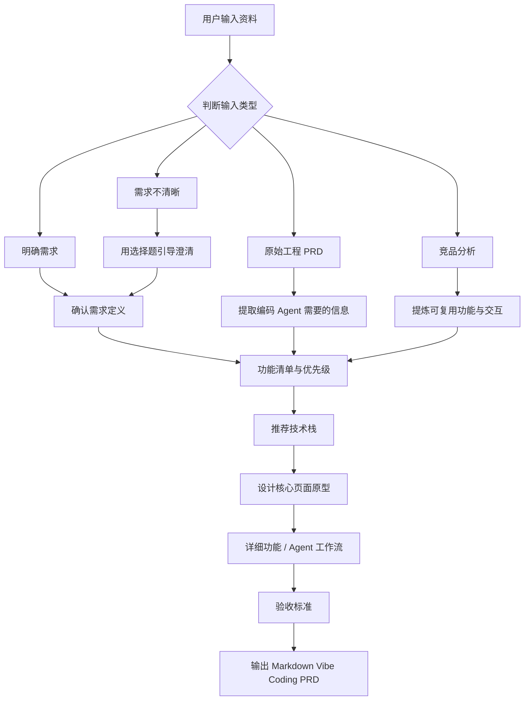
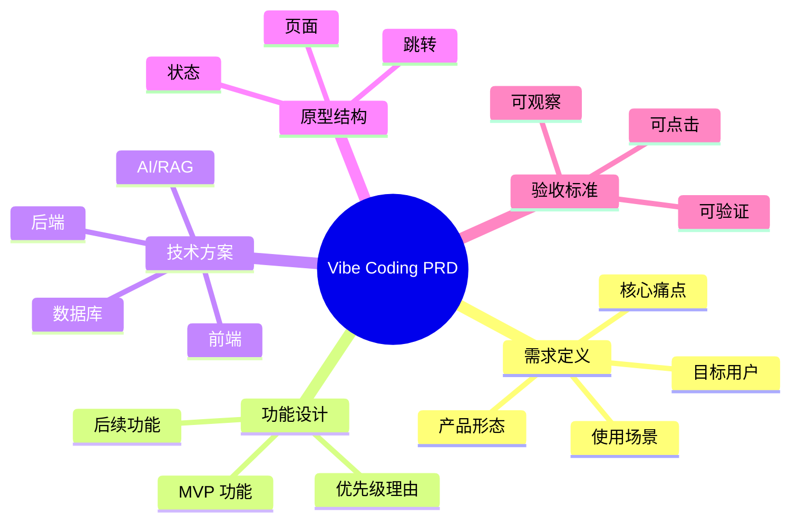

# Vibe Coding PRD Skill

> 把需求、原始 PRD、竞品分析、飞书文档等杂乱输入，提炼成可以直接发给 Claude Code / Codex 的 coding-ready PRD。


## 这个 Skill 解决什么问题

很多产品资料不适合直接发给编码 Agent：

- 需求太散，缺少用户、场景、痛点和范围确认
- 原始 PRD 太重，包含大量商业背景和汇报内容
- 竞品分析只有参考截图，没有转成可实现功能
- 验收标准模糊，编码 Agent 不知道做到什么程度算完成

这个 skill 会把这些内容整理成一份更适合编码 Agent 的 PRD：短、清晰、可实现、可验收。

## 触发方式

```text
帮我写一个用来vibe coding的PRD
```

也适用于：

```text
把这个飞书 PRD 整理成能发给 Claude Code 的版本
```

```text
根据这个竞品分析，帮我写一个 coding-ready PRD
```

## 工作流程



## 输入类型处理

| 输入类型 | 处理方式 |
|---|---|
| 明确需求 | 进入功能设计，但仍会确认范围和优先级 |
| 原始 PRD | 去掉商业背景，提取工程实现需要的信息 |
| 竞品分析 | 提炼可复用功能、页面结构和交互模式 |
| 飞书/Lark 链接 | 调用飞书/Lark 文档能力读取内容 |
| 需求不清晰 | 先用选择题引导用户确认真实需求 |

## 输出内容

最终输出一份 Markdown PRD，包含：

- 来源类型与范围
- 需求定义
- 用户流程
- 功能清单与优先级
- 推荐技术栈
- 原型结构
- 详细功能设计
- AI / Agent 设计
- 数据模型 / API 设计
- 边界情况与兜底
- 验收标准
- 编码 Agent 执行说明

## 输出结构示意



## 安装方式

把本仓库放到你的 skills 目录下：

```bash
mkdir -p ~/.agents/skills
git clone https://github.com/YOUR_NAME/vibe-coding-prd-skill.git ~/.agents/skills/vibe-coding-prd
```

重启 Codex 后即可使用。

## 文件结构

```text
vibe-coding-prd/
├── SKILL.md
└── agents/
    └── openai.yaml
```

## 使用建议

为了让输出更准确，建议一次性提供：

- 需求描述或原始 PRD
- 目标用户
- 产品形态
- 是否要做 MVP
- 是否有技术栈限制
- 是否需要 AI / Agent / RAG

如果这些信息缺失，skill 会先追问，不会直接替你假设。
